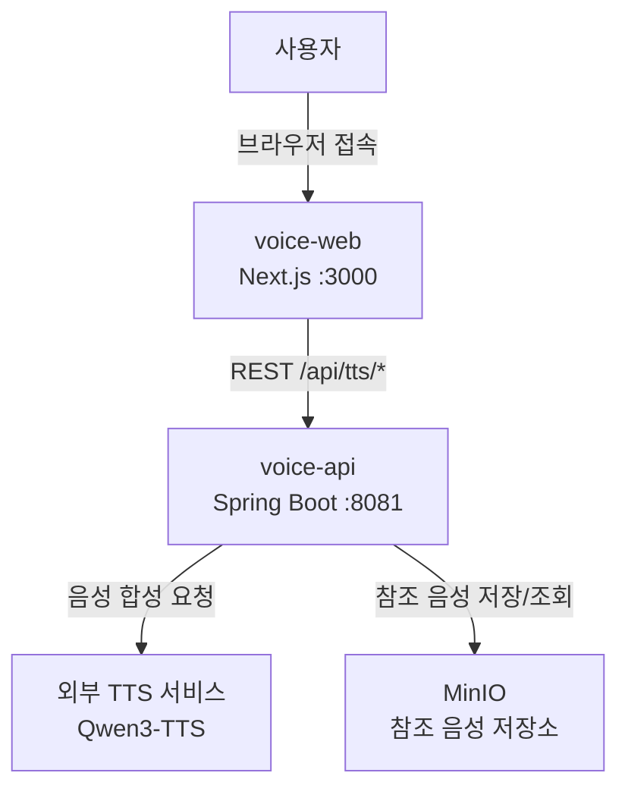
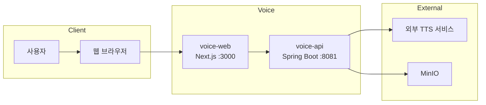
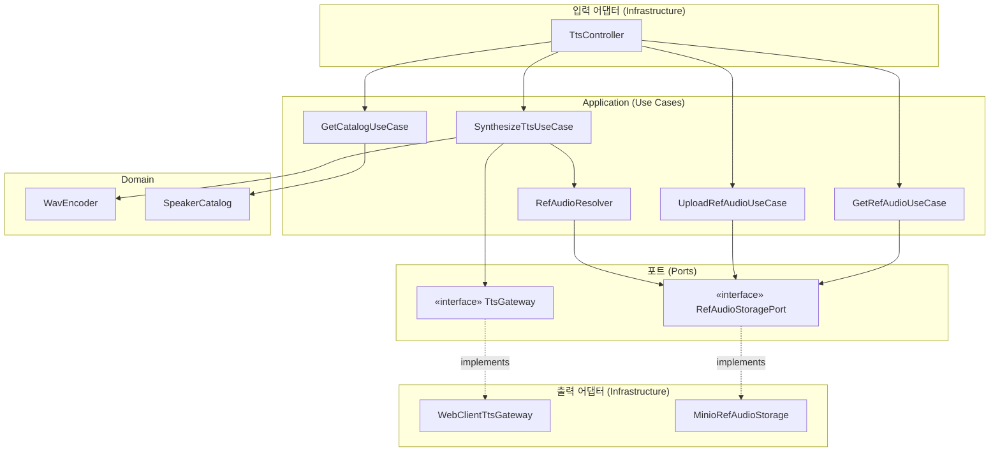
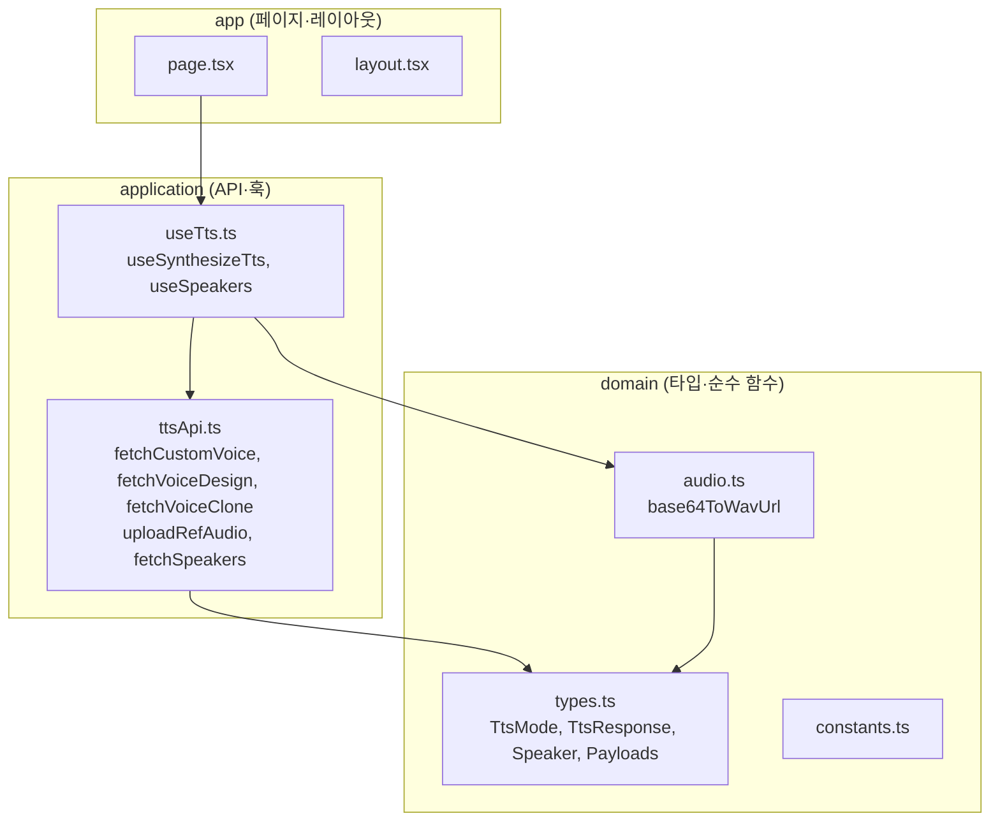
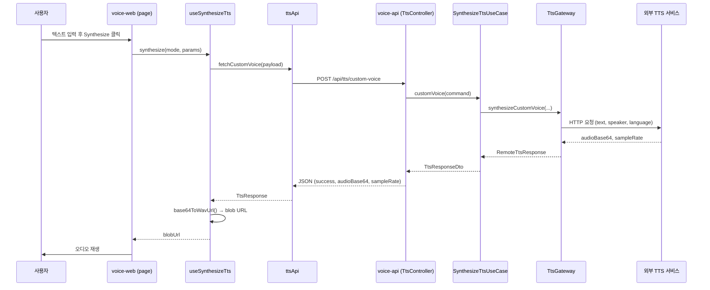
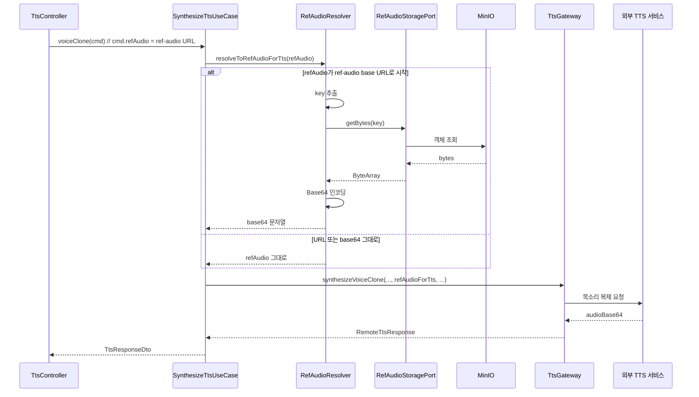
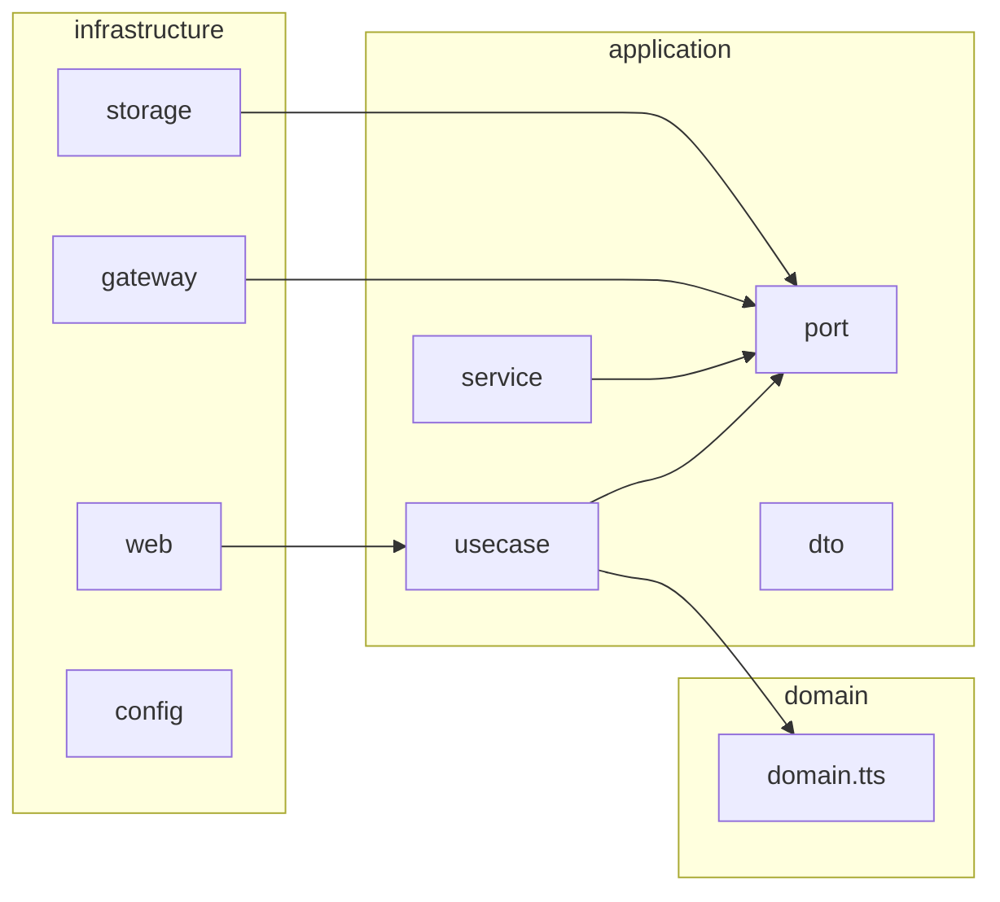

# voice-stack
<br/>

<Br/><br/>

## 프로젝트 소개

Voice 서비스는 Qwen3-TTS 기반 텍스트-음성 합성(TTS) 웹 애플리케이션입니다. CustomVoice(정해진 스피커), VoiceDesign(자연어 설명으로 음색·감정 지정), VoiceClone(참조 음성으로 목소리 복제)을 지원하며, 웹 브라우저만으로 편하게 음성을 합성할 수 있는 서비스입니다.

## 설치할 필요가 없습니다

이 서비스는 voice-api와 voice-web을 실행한 뒤, 웹 브라우저만 있으면 별도 설치는 필요 없습니다. PC와 모바일 모두 이용 가능하며, 앱처럼 쓰고 싶다면 브라우저에서 홈 화면에 바로가기 추가를 눌러 사용할 수 있습니다.

## 기존의 웹 서비스를 대체합니다

기존 텍스트-음성 합성 웹 서비스들은 느리거나 사용이 불편한 경우가 많습니다. Voice에서는 Kotlin Spring Boot 백엔드와 Next.js 프론트엔드로 사용자 경험을 개선하였습니다. 스피커 선택, 자연어 설명 입력, 목소리 복제를 하나의 화면에서 편하게 이용할 수 있습니다.

## 다양한 음성 합성 방식을 제공합니다

CustomVoice(미리 정의된 스피커), VoiceDesign(자연어로 음색·감정 지정), VoiceClone(참조 음성으로 목소리 복제)을 지원합니다. 지원 스피커·언어 목록 조회와 WAV 스트리밍까지 제공하여, 필요한 정보와 재생 방식을 한곳에서 확인할 수 있습니다.

## 참조 음성 업로드 및 목소리 복제

VoiceClone을 위해 참조 오디오를 MinIO에 업로드하고, 업로드된 URL로 바로 목소리 복제 합성을 할 수 있습니다. 참조 음성 재생·확인 기능으로 품질을 확인한 뒤 합성에 활용할 수 있습니다.

---

## 상세 개요 및 주요 기능

**Voice**는 Python 없이 **Kotlin Spring Boot** 백엔드와 **Next.js** 프론트엔드로 구성되며, DDD·함수형 구조를 따릅니다. 실제 음성 합성 연산은 **외부 TTS 서비스**(`TTS_SERVICE_URL`)에 위임하고, voice-api는 프록시·캐탈로그·인코딩 역할을 담당합니다.

| 기능 | 설명 |
|------|------|
| **CustomVoice** | 미리 정의된 스피커(Ryan 등)로 텍스트 합성. 스피커 선택 + 선택적 Instruct. |
| **VoiceDesign** | 자연어 설명(Instruct)으로 음색/감정을 지정해 합성. |
| **VoiceClone** | 참조 오디오(URL 또는 base64) + 참조 텍스트로 목소리 복제 합성. |
| **참조 음성 업로드 (MinIO)** | VoiceClone용 참조 오디오를 MinIO에 업로드. 업로드된 URL로 바로 목소리 복제 가능. |
| **스피커·언어 목록** | 지원 스피커 목록(`/api/tts/speakers`), 지원 언어 목록(`/api/tts/languages`) 조회. |
| **스트리밍** | CustomVoice 스트리밍 엔드포인트로 WAV 바이너리 스트리밍 지원. |

### 아키텍처 구조

```
voice (모노레포)
├── voice-api (Kotlin + Spring Boot 3.2, port 8081)
│   ├── domain          … TtsResult, WavEncoder, SpeakerCatalog
│   ├── application     … port(TtsGateway), use-case(SynthesizeTts, GetCatalog), dto
│   └── infrastructure  … WebClientTtsGateway, TtsController, config
│
└── voice-web (Next.js 14, port 3000)
    ├── domain      … types, constants, pure fns(audio)
    ├── application … api(ttsApi), hooks(useTts)
    └── app         … pages, layout, globals
```

- **voice-api**: 헥사고널(포트/어댑터). `TtsGateway` 포트로 외부 TTS 서비스 호출, UseCase가 오케스트레이션.
- **voice-web**: 도메인(타입·순수 함수) / 애플리케이션(API·훅) / 앱(페이지) 3계층.

---

### 시스템 컨텍스트 다이어그램

전체 시스템에서 사용자, voice-web, voice-api, 외부 서비스 간의 관계입니다.



단순 플로우:



---

### voice-api 헥사고널 아키텍처 (UML 스타일)

Application(UseCase)이 Port를 통해 외부를 추상화하고, Infrastructure가 Adapter로 구현합니다.



---

### voice-web 계층 구조

도메인 → 애플리케이션 → 앱 순의 의존 방향을 가집니다.



---

### TTS 합성 시퀀스 다이어그램 (CustomVoice 예시)

사용자가 CustomVoice로 합성 요청 시 end-to-end 흐름입니다.



---

### VoiceClone + 참조 음성 URL 해석 시퀀스

refAudio가 voice-api의 ref-audio URL일 때, MinIO에서 바이트를 읽어 base64로 변환한 뒤 TTS에 전달합니다.



---

### voice-api 패키지 구조 (의존성 방향)



- **domain**: 비즈니스 핵심 타입·로직 (TtsResult, WavEncoder, SpeakerCatalog)
- **application**: 포트(인터페이스), 유스케이스, DTO. 외부 의존은 Port를 통해서만.
- **infrastructure**: HTTP 컨트롤러, TtsGateway 구현(WebClient), RefAudioStorage 구현(MinIO), 설정.

### URL 및 엔드포인트

| 구분 | URL | 비고 |
|------|-----|------|
| **웹 UI** | `http://localhost:3000` | voice-web 개발 서버 |
| **API 서버** | `http://localhost:8081` | voice-api (Tomcat) |
| **API 베이스** | `http://localhost:8081/api/tts` | 모든 TTS API 공통 prefix |

**voice-web → voice-api 연동**

- `NEXT_PUBLIC_VOICE_API_URL` 이 비어 있으면: 브라우저 요청 `/api/tts/*` 가 Next.js **rewrites** 로 `http://localhost:8081/api/tts/*` 에 전달됨.
- 별도 API 서버를 쓰면 `.env.local` 에 `NEXT_PUBLIC_VOICE_API_URL=http://localhost:8081` 등으로 지정.

**주요 API 경로**

| Method | Path | 설명 |
|--------|------|------|
| GET | `/api/tts/speakers` | 스피커 목록 |
| GET | `/api/tts/languages` | 언어 목록 |
| POST | `/api/tts/custom-voice` | CustomVoice 합성 |
| POST | `/api/tts/voice-design` | VoiceDesign 합성 |
| POST | `/api/tts/voice-clone` | VoiceClone 합성 |
| POST | `/api/tts/upload-ref-audio` | 참조 음성 파일 MinIO 업로드 (multipart, 반환: `url`, `key`) |
| GET | `/api/tts/ref-audio/{key}` | 업로드된 참조 음성 스트리밍 (재생/다운로드) |
| POST | `/api/tts/custom-voice/stream` | CustomVoice WAV 스트리밍 |

---

- **voice-api**: Kotlin + Spring Boot 3.2 — domain / application(use-case, port) / infrastructure(gateway, web)
- **voice-web**: Next.js 14 — domain(types, pure fns) / application(api, hooks) / app(pages)

---

## 사전 요구사항

| 항목 | voice-api | voice-web |
|------|-----------|-----------|
| JDK | 17 | - |
| Node | - | 18+ (LTS 권장) |
| Gradle | 8+ (또는 IDE) | - |
| npm | - | 9+ |

---

## 1. voice-api 실행 방법

### 1-1. IDE에서 실행 (권장)

1. IDE에서 `voice/voice-api` 폴더를 프로젝트 루트로 연다.
2. `VoiceApiApplication.kt` 를 찾아 **Run** 한다.
3. 콘솔에 `Tomcat started on port(s): 8081` 이 보이면 성공.

### 1-2. Gradle으로 실행

```bash
cd voice/voice-api
gradle bootRun
```

또는 Gradle Wrapper가 있다면:

```bash
cd voice/voice-api
./gradlew bootRun
# Windows: gradlew.bat bootRun
```

### 1-3. 환경 변수 (선택)

| 변수 | 기본값 | 설명 |
|------|--------|------|
| `TTS_SERVICE_URL` | `http://localhost:8000` | 외부 TTS 서비스 URL. 실제 합성 시 이 서비스가 응답해야 함. |
| `VOICE_WEB_ORIGIN` | `http://localhost:3000` | CORS 허용 오리진(Next.js 개발 서버). |
| `MINIO_ENDPOINT` | `http://localhost:9000` | MinIO 서버 URL (참조 음성 업로드용). |
| `MINIO_ACCESS_KEY` | `minioadmin` | MinIO Access Key. |
| `MINIO_SECRET_KEY` | `minioadmin` | MinIO Secret Key. |
| `MINIO_BUCKET` | `voice-ref` | 참조 음성 저장 버킷 이름. |
| `REF_AUDIO_BASE_URL` | `http://localhost:8081/api/tts/ref-audio` | 업로드 후 반환되는 ref-audio URL prefix (VoiceClone 시 이 URL이면 MinIO에서 조회해 base64로 TTS에 전달). |

예시 (Windows PowerShell):

```powershell
$env:TTS_SERVICE_URL = "http://your-tts-host:8000"
$env:VOICE_WEB_ORIGIN = "http://localhost:3000"
gradle bootRun
```

예시 (Linux / macOS):

```bash
export TTS_SERVICE_URL=http://your-tts-host:8000
export VOICE_WEB_ORIGIN=http://localhost:3000
./gradlew bootRun
```

### 1-4. 동작 확인

- 브라우저 또는 curl: `http://localhost:8081/api/tts/speakers`
- JSON 으로 스피커 목록이 오면 정상.

---

## 2. voice-web 실행 방법

### 2-1. 의존성 설치 및 개발 서버 기동

```bash
cd voice/voice-web
npm install
npm run dev
```

### 2-2. 브라우저 접속

- 주소: **http://localhost:3000**
- voice-api 가 **8081** 에 떠 있어야 합성 요청이 프록시됨.

### 2-3. 환경 변수 (선택)

| 변수 | 기본값 | 설명 |
|------|--------|------|
| `NEXT_PUBLIC_VOICE_API_URL` | `""` (빈 문자열) | 비어 있으면 같은 호스트의 `/api/tts/*` 가 Next.js rewrites 로 **localhost:8081** 로 전달됨. 별도 API 서버를 쓰려면 예: `http://localhost:8081` 지정. |

`.env.local` 예시:

```
NEXT_PUBLIC_VOICE_API_URL=http://localhost:8081
```

### 2-4. 프로덕션 빌드 및 실행

```bash
cd voice/voice-web
npm run build
npm run start
```

- 기본 포트 3000. API 는 여전히 **voice-api(8081)** 또는 `NEXT_PUBLIC_VOICE_API_URL` 로 요청됨.

---

## 3. 사용 순서 (전체 플로우)

1. **voice-api 먼저 실행**  
   - IDE 또는 `gradle bootRun` / `./gradlew bootRun`  
   - 8081 포트 확인.

2. **voice-web 실행**  
   - `npm install` → `npm run dev`  
   - 브라우저에서 http://localhost:3000 접속.

3. **화면에서 사용**  
   - **Mode**: CustomVoice / VoiceDesign / VoiceClone 중 선택.  
   - **Text**: 합성할 문장 입력.  
   - **Language**: Auto, Chinese, English 등 선택.  
   - **CustomVoice** 일 때: Speaker 선택, Instruct(선택).  
   - **VoiceDesign** 일 때: Instruct(자연어 설명) 필수.  
   - **VoiceClone** 일 때: Ref audio(URL 또는 base64), Ref text(선택).  
   - **Synthesize** 클릭 → 재생 영역에서 재생.

4. **TTS 서비스가 없을 때**  
   - voice-api 는 `TTS_SERVICE_URL` 로 요청을 보냄.  
   - 해당 서비스가 없으면 "TTS service not running. Set TTS_SERVICE_URL..." 메시지가 JSON 으로 반환됨.  
   - 실제 음성 파일을 받으려면 Qwen3-TTS 호환 서비스를 띄우고 `TTS_SERVICE_URL` 에 연결하면 됨.

5. **VoiceClone + MinIO 업로드**  
   - **Mode**에서 VoiceClone 선택 → **Ref audio**에 파일을 업로드하면 MinIO에 저장되고 URL이 채워짐.  
   - 그 상태에서 **Text** 입력 후 **Synthesize** 하면, voice-api가 해당 URL을 MinIO에서 읽어 base64로 변환한 뒤 TTS 서비스에 전달해 목소리 복제 합성이 이루어짐.  
   - MinIO가 없으면 업로드만 실패하고, URL/base64 직접 입력은 그대로 사용 가능.

---

## 4. API 엔드포인트 (voice-api)

| Method | Path | 요청 본문 예시 | 설명 |
|--------|------|----------------|------|
| POST | `/api/tts/custom-voice` | `{"text":"hello","language":"English","speaker":"Ryan","instruct":""}` | CustomVoice 합성 |
| POST | `/api/tts/voice-design` | `{"text":"hello","language":"English","instruct":"Very happy."}` | VoiceDesign 합성 |
| POST | `/api/tts/voice-clone` | `{"text":"hello","language":"English","refAudio":"https://...","refText":"..."}` | VoiceClone 합성 |
| POST | `/api/tts/upload-ref-audio` | multipart `file` | MinIO 참조 음성 업로드 → `{ "url", "key" }` |
| GET | `/api/tts/ref-audio/{key}` | - | 업로드된 참조 음성 스트리밍 |
| POST | `/api/tts/custom-voice/stream` | 동일 | WAV 바이너리 스트리밍 |
| GET | `/api/tts/speakers` | - | 지원 스피커 목록 |
| GET | `/api/tts/languages` | - | 지원 언어 목록 |

### 4-1. 참조 음성 업로드 (MinIO)

```bash
curl -X POST http://localhost:8081/api/tts/upload-ref-audio \
  -F "file=@/path/to/ref.wav"
```

응답 예시:

```json
{ "url": "http://localhost:8081/api/tts/ref-audio/uuid.wav", "key": "uuid.wav" }
```

VoiceClone 요청 시 `refAudio`에 위 `url`을 넣으면, voice-api가 MinIO에서 파일을 읽어 base64로 변환 후 TTS 서비스에 전달합니다.

### 4-2. curl 예시 (CustomVoice)

```bash
curl -X POST http://localhost:8081/api/tts/custom-voice \
  -H "Content-Type: application/json" \
  -d "{\"text\":\"Hello world.\",\"language\":\"English\",\"speaker\":\"Ryan\"}"
```

응답 예시 (실제 TTS 서비스가 있을 때):

```json
{
  "success": true,
  "audioBase64": "...",
  "sampleRate": 24000
}
```

---

## 5. 아키텍처 요약

- **voice-web (Next.js, port 3000)**  
  - `/api/tts/*` → `next.config.js` rewrites → **http://localhost:8081/api/tts/***  
  - domain: 타입·상수·순수 함수(audio). application: api 호출·hooks. app: 페이지.

- **voice-api (Kotlin, port 8081)**  
  - **domain**: TtsResult, WavEncoder, SpeakerCatalog  
  - **application**: port(TtsGateway, RefAudioStoragePort), use-case(SynthesizeTts, GetCatalog, UploadRefAudio, GetRefAudio), RefAudioResolver  
  - **infrastructure**: WebClientTtsGateway, TtsController, MinioRefAudioStorage  
  - TTS 실제 연산은 `TTS_SERVICE_URL` 외부 서비스에 위임. 참조 음성은 MinIO 업로드 후 URL로 VoiceClone 시 자동 해석(base64 변환).

---

## 6. 트러블슈팅

| 현상 | 확인·조치 |
|------|-----------|
| voice-web 에서 "Synthesis failed" / "TTS service not running" | voice-api(8081) 이 떠 있는지 확인. 그리고 TTS 서비스가 없으면 해당 메시지는 정상. 실제 합성을 쓰려면 Qwen3-TTS 호환 서비스를 띄우고 `TTS_SERVICE_URL` 설정. |
| CORS 오류 | voice-api 의 `VOICE_WEB_ORIGIN` 이 프론트 주소와 일치하는지 확인 (기본 `http://localhost:3000`). |
| 8081 포트 사용 중 | 다른 프로세스가 8081 을 쓰는지 확인. `application.yml` 의 `server.port` 를 바꾸거나 해당 프로세스 종료. |
| Next.js 에서 API 호출이 안 감 | `next.config.js` rewrites 대상이 `http://localhost:8081` 인지 확인. `NEXT_PUBLIC_VOICE_API_URL` 을 쓰면 해당 URL 로 직접 요청. |
| Gradle 없음 | IDE 로 voice-api 만 열어서 `VoiceApiApplication` 실행. 또는 [Gradle 설치](https://gradle.org/install/) 후 `gradle bootRun`. |
| 참조 음성 업로드 실패 (MinIO) | MinIO 서버가 떠 있는지 확인. Docker 예: `docker run -p 9000:9000 -p 9001:9001 minio/minio server /data --console-address ":9001"`. 환경 변수 `MINIO_ENDPOINT`, `MINIO_ACCESS_KEY`, `MINIO_SECRET_KEY` 확인. |

---

## 7. MinIO 실행 (참조 음성 업로드용)

VoiceClone 시 **파일 업로드**로 참조 음성을 쓰려면 MinIO가 필요합니다.

- Docker 예시:

```bash
docker run -d -p 9000:9000 -p 9001:9001 --name minio-voice minio/minio server /data --console-address ":9001"
```

- 기본 접속: `http://localhost:9001` (콘솔), API: `http://localhost:9000`. 기본 계정 `minioadmin` / `minioadmin`.
- voice-api는 `MINIO_*` 환경 변수로 연결하며, 버킷 `voice-ref`는 없으면 자동 생성됩니다.

---

## 8. TTS 서비스 연동 (실제 음성 합성)

voice-api 는 **외부 TTS 서비스**만 호출합니다. 아래 중 하나로 연동할 수 있습니다.

- **옵션 A**: Python `qwen-tts` 등으로 Qwen3-TTS 호환 HTTP 서비스를 별도 실행한 뒤, 그 URL 을 `TTS_SERVICE_URL` 에 설정.
- **옵션 B**: DashScope 등 상용 API 를 쓰는 경우, voice-api 에 해당 API 클라이언트를 구현하고 `TtsGateway` 구현체에서 호출하도록 변경.

요청/응답 형식은 Qwen3-TTS 문서(CustomVoice, VoiceDesign, VoiceClone)를 참고하면 됩니다.
